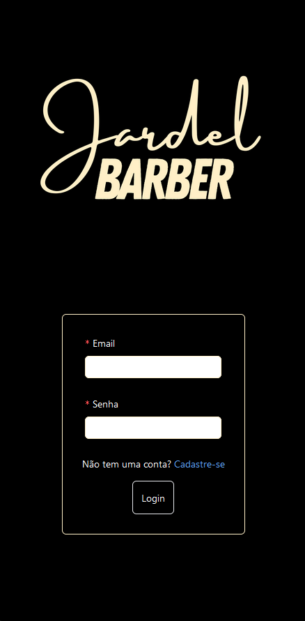

<h1 align='center'>
    
    <p>Agora sua ida ao barbeiro ficou mais simples e prática</p>
</h1>

## 📕 Sobre

**The barber** está sendo desenvolvido ser uma aplicação Full Stack e o intuito com essa aplicação é melhorar o meu entendimento sobre **regras de negocio**, como realizar de forma **mais eficiente** a integração entre front, back e DB. Essa plicação também está servindo para **melhorar** ainda mais os meus **conhecimentos em back-end** e integração com BD. Espero que ajude você a também conseguir ter o entendimento que eu esto tendo a respeito do desenvolvimento de software. E além do mais, vai resolver um problema de um colega meu aqui da cidade, isso é excepcional.

## 🛠️ Recursos Utilizados para desenvolver a aplicação Full Stack

### Client

- React;
- antd;
- axios;
- react-redux e redux/toolkit;
- moment;
- react-roter-dom;
- react-spinners;

### Server

- Node;
- bcrypt;
- colors;
- cors;
- dotenv;
- express;
- jsonWebToken;
- mongoose;
- morgan;
- nodemon;

## Banco de dados

- MongoDB

## 👨🏾‍💻 Como rodar o projeto na sua máquina

```bash
# Com a sua chave SSH ativada, selecione a pasta onde você quer colocar esse projeto, abra o terminal nela e depois copie e cole o seguinte comando no seu terminal:

$ git clone git@github.com:leofrs/website-vestuario.git
```

Após ter feito o clone, instale as dependências necessárias para rodar o projeto. Com a pasta do projeto aberta no terminal, execute os seguintes comandos um por vêz

```bash
# Se você utiliza npm, abra a pasta client no terminal e em outro terminal abra a pasta server e insira o seguinte comendo em cada terminal
$ npm i
```

```bash
# Se você utiliza yarn, abra a pasta client no terminal e em outro terminal abra a pasta server e insira o seguinte comendo em cada terminal
$ yarn i
```

obs: Como este projeto foi criado com o vite, execute o comando **npm run dev** para rodar em sua máquina.

## 🧾 Licença

Este Projeto utiliza a lincença MIT.
